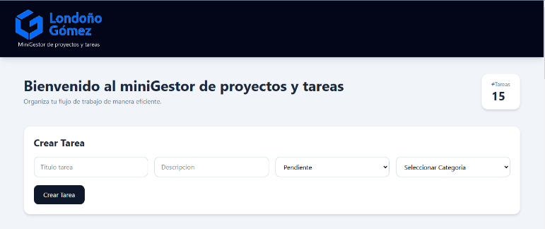
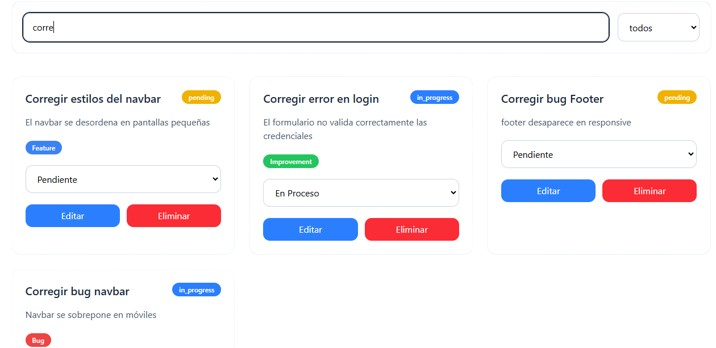

# DevBoard

Mini gestor de proyectos y tareas desarrollado con React, Node.js, Express y PostgreSQL.

## Tecnologías
- React + Vite
- Node.js
- Express
- PostgreSQL
- TailwindCSS

## Funcionalidades
- CRUD de tareas
- Categorías
- Filtros
- Búsqueda en tiempo real
- Paginación
- Skeleton loaders

## Variables de entorno abre el proyecto desde VSCODE
se necesita crear en la raiz de la carpeta backend un archivo .env en el cual deberas de poner la configuracion de tu PostgreSQL

PORT=3000

DB_HOST=

DB_PORT=

DB_USER=

DB_PASSWORD=

DB_NAME=

## Base de datos

Colocar los siguientes archivos que contienen consultas para la creacion de la base de datos en PostgreSQL(pgAdmin4):

-nombre base de datos: devboard

Colocar las siquientes consultas en el Query de la base de datos que se encuentran en:

backend/bd/schema.sql

backend/bd/seed.sql

ejecutar.

## Instalación / Correr APP
Se necesitan de 2 terminales Desde de VSCODE corriendo en simultaneo

* 1ra terminal:
  
cd fronted

npm install 

npm run dev

* 2da terminal:

cd backend 

npm install 

npm run dev

mirar pagina: http://localhost:5173/

## Dashboard Principal

---

## Gestión de Tareas

---
